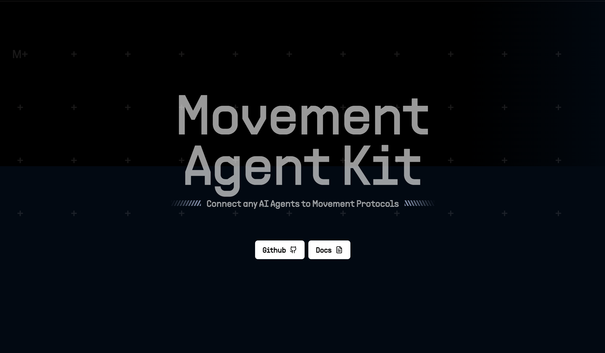

<div align="center">

# Movement Agent Kit

An open-source toolkit for connecting AI agents to Movement protocols.



</div>

<br />

<strong>Movement Agent Kit</strong> is a comprehensive toolkit designed to streamline AI agents' interactions with the Movement Blockchain and its ecosystem. It offers a unified interface for executing various blockchain operations, enabling developers to build AI-driven applications that seamlessly integrate with different Movement-based protocols and applications.

Serving as a bridge between AI agents and the Movement Blockchain ecosystem, the toolkit facilitates smooth integration of blockchain capabilities into AI-powered applications. Whether you're developing a chatbot with wallet functionality or a sophisticated multi-agent system, the Movement Agent Kit provides essential tools and abstractions to efficiently manage blockchain interactions.

### Key Features

#### Token Operations
- Standard Token Management

- Transfer tokens between accounts

- Balance Checks

- Mint new tokens

- Burn existing tokens

#### NFT Operations

- Create new NFT collections

- Mint NFTs

- Transfer NFTs between accounts

- Burn NFTs

#### Blockchain Interaction
- Read and parse blockchain data

- Monitor blockchain events

- Execute smart contract calls

#### Account Management
- Transaction signing

- Message signing

- Account creation and management

#### Market Data Integration

- CoinGecko Pro API integration

- Real-time token price data

- Trending tokens and pools

- Top gainers analysis

- Token information lookup

## Supported Applications
Movement Agent Kit provides native integration with several prominent Movement applications:

| Protocol    |
|-------------|
| Allora      |
| Coingecko   |
| Dexscreener |
| Elfa AI     |
| Echelon     |
| LiquidSwap  |
| OpenAI      |
| Pyth        |

### Upcoming Features

- Additional Token Operations

- More Protocols Integrations

- Twitter Integration for social media interaction

- Publish the movement-agent-kit as an npm package

### Architecture Overview
Movement Agent Kit follows a modular architecture that enables easy extension and maintenance:

<pre>
Movement Agent Kit
├── Core Modules
│   ├── Token Operations
│   ├── Blockchain Reader
│   └── Account Operations
├── Integration Layer
│   ├── Application Connectors
│   └── Protocol Adapters
└── Extension Modules
    ├── Image Generation
    └── Social Media Integration (Coming Soon)
</pre>


## Installation

### From Source
```bash
git clone https://github.com/Movement-Agent-Kit/movement-agent-kit
cd movement-agent-kit
npm i
```
### Using NPM
```bash
Coming Soon
```


## Quick Start

### Basic Setup
First, import the necessary modules:

```typescript
const config = new AptosConfig({ 
	network,
	fullnode: MOVEMENT_NETWORK_CONFIG[DEFAULT_NETWORK].fullnode
})

const aptos = new Aptos(config);

const account = await aptos.deriveAccountFromPrivateKey({
	privateKey: new Ed25519PrivateKey(
		PrivateKey.formatPrivateKey(
			process.env.PRIVATE_KEY,
			PrivateKeyVariants.Ed25519,
		),
	),
});
```
### Configure Your Environment
Create a configuration file .env in your project root:

```typescript
MOVEMENT_PRIVATE_KEY="private key"
ANTHROPIC_API_KEY="API Key"
OPENAI_API_KEY="API Key"
``` 

### Initialize the Client

```typescript
const signer = new LocalSigner(account, Network.CUSTOM);
const agent = new AgentRuntime(signer, aptos, {
	ELFA_AI_API_KEY: process.env.ELFA_AI_API_KEY, // optional
	ALLORA_API_KEY: process.env.ALLORA_API_KEY, // optional
	COINGECKO_API_KEY: process.env.COINGECKO_API_KEY, // optional
	OPENAI_API_KEY: process.env.OPENAI_API_KEY // optional
});
const tools = createMovementTools(aptosAgent);
```

### Basic Operations Examples
#### Token Transfer

```typescript
const result = agent.transferTokens("to_address", 1.0)
```

#### Read Blockchain Data

```typescript
// Get Balance
const balance = agent.getBalance("0x123...")

// Get transaction details
const tx_info = agent.transferTokens("0x789...")
```

## LangChain Integration

```typescript
import { ChatAnthropic } from "@langchain/anthropic";
import { MemorySaver } from "@langchain/langgraph";
import { createReactAgent } from "@langchain/langgraph/prebuilt";
import { HumanMessage } from "@langchain/core/messages";

const llm = new ChatAnthropic({
    temperature: 0.7,
    model: "claude-3-5-sonnet-20241022",
});

const memory = new MemorySaver();

const agent = createReactAgent({
    llm,
    tools,
    checkpointSaver: memory,
    messageModifier: `
        You are a helpful agent that can interact onchain using the Movement Agent Kit. You are
        empowered to interact onchain using your tools. If you ever need funds, you can request them from the
        faucet. If not, you can provide your wallet details and request funds from the user. If there is a 5XX
        (internal) HTTP error code, ask the user to try again later. If someone asks you to do something you
        can't do with your currently available tools, you must say so, and encourage them to implement it
        themselves using the Movement Agent Kit, recommend they go to movement-agent-kit repo for more information. Be
        concise and helpful with your responses. Refrain from restating your tools' descriptions unless it is explicitly requested.
    `,
});

const stream = await agent.stream(
    {
        messages: [new HumanMessage("Transfer 1 MOVE to 0x123...")],
    },
    config
);

for await (const chunk of stream) {
    if ("agent" in chunk) {
        console.log(chunk.agent.messages[0].content);
    } else if ("tools" in chunk) {
        console.log(chunk.tools.messages[0].content);
    }
    console.log("-------------------");
}
```


## Examples and Use Cases
<br/>

### Interactive Wallet Chatbot

A natural language interface for interacting with Movement blockchains. Users can send commands in plain English to perform blockchain operations.

#### Features:
- Send/receive tokens and NFTs
- Check balances and transaction history
- Create NFT collections
- Interact with DeFi protocols

<br />


### Multi-Agent System (LangGraph Based)
A system of specialized AI agents working together to perform complex blockchain operations and bull post on twitter:

- Manager Agent: Coordinates decisions and tasks
- Tweet Writer Agent: Write bull posts about various onchain data
- X Post Agent: Post tweets on X/Twitter

<br />

## Acknowledgments
We have taken inspiration from the solana-agent-kit and this project would not have been possible without the help from solana-agent-kit.

## Contributing
We welcome contributions! Please submit a pull request for adding a new tool or resolving some bugs.

## Security

This toolkit handles private keys and transactions. Always ensure you're using it in a secure environment and never share your private keys.
